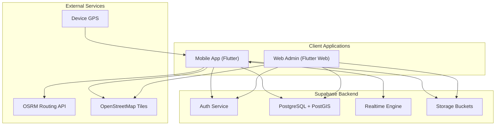
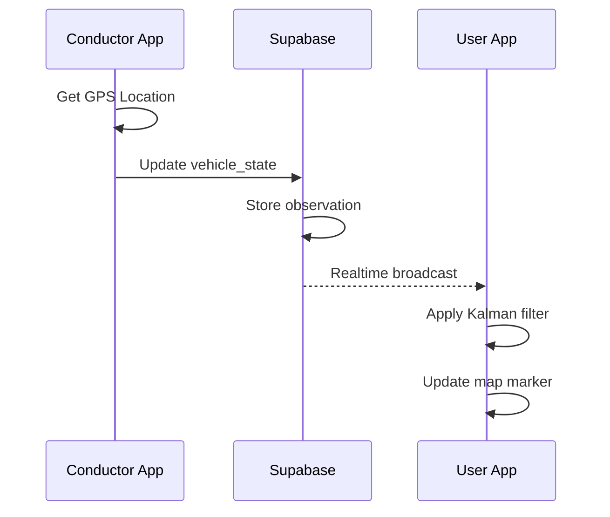
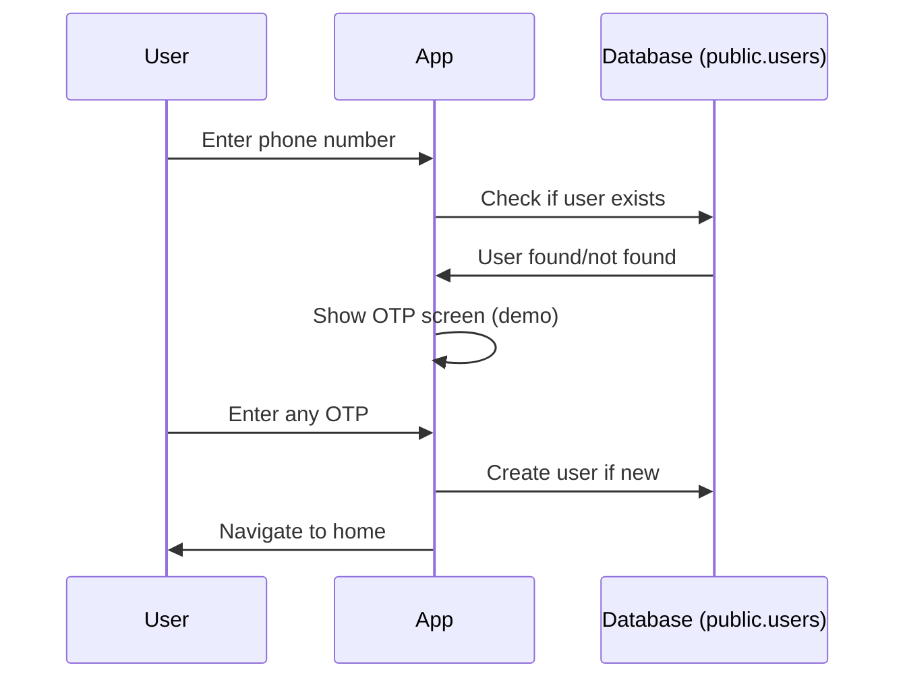

# System Architecture

## High-Level Architecture



## Technology Stack

### Frontend
| Technology | Purpose |
|------------|---------|
| **Flutter 3.10+** | Cross-platform UI framework |
| **Provider** | State management |
| **flutter_map** | OpenStreetMap integration |
| **Geolocator** | GPS location services |
| **simple_kalman** | Location smoothing filter |

### Backend
| Technology | Purpose |
|------------|---------|
| **Supabase** | Backend-as-a-Service |
| **PostgreSQL** | Primary database |
| **PostGIS** | Geographical queries |
| **Realtime** | Live subscriptions |
| **Row Level Security** | Data access control |

## Application Structure

```
kerala_private_bus_tracking/
├── lib/
│   ├── main.dart                 # Entry point
│   ├── app_theme.dart            # Theme definitions
│   │
│   ├── config/                   # Configuration
│   │   └── supabase_config.dart
│   │
│   ├── models/                   # Data models
│   │   ├── bus_model.dart
│   │   ├── route_model.dart
│   │   ├── user_model.dart
│   │   ├── stop_model.dart
│   │   ├── sos_alert_model.dart
│   │   └── ... (16 models total)
│   │
│   ├── screens/                  # UI screens
│   │   ├── admin/                # Admin panel (10 screens)
│   │   ├── auth/                 # Login, OTP (2 screens)
│   │   ├── conductor/            # Conductor app (4 screens)
│   │   └── user/                 # Passenger app (7 screens)
│   │
│   ├── services/                 # Business logic
│   │   ├── supabase_queries.dart # Database operations
│   │   ├── eta_service.dart      # ETA calculations
│   │   ├── routing_service.dart  # Route path fetching
│   │   └── ... (14 services)
│   │
│   └── widgets/                  # Reusable components
│       ├── bus_card.dart
│       ├── sos_button.dart
│       └── ... (6 widgets)
│
├── android/                      # Android platform
├── ios/                          # iOS platform
├── web/                          # Web platform
└── docs/                         # Documentation
```

## Data Flow

### Real-time Bus Tracking



### User Authentication (Demo Mode)



> [!NOTE]
> This is a demo application. Authentication is simulated using the `public.users` table without actual OTP verification.

## Key Design Patterns

### 1. Repository Pattern
Database operations are centralized in `supabase_queries.dart`:
```dart
class SupabaseQueries {
  static Future<List<BusModel>> fetchAllBuses() async {...}
  static Future<void> updateBusLocation(...) async {...}
}
```

### 2. Service Layer
Business logic separated from UI:
- `ETAService` - Arrival time calculations
- `RoutingService` - Path polyline fetching
- `ProximityAlertService` - Stop arrival notifications

### 3. Kalman Filtering
Smooth GPS updates using predictive filtering:
```dart
KalmanFilter latFilter = KalmanFilter();
KalmanFilter lngFilter = KalmanFilter();
// Apply filtering to raw GPS coordinates
```

## Security Architecture

- **Row Level Security (RLS)** - Database-level access control
- **Phone OTP Authentication** - Secure login
- **Role-based Access** - User, Conductor, Admin roles
- **Content Moderation** - Message filtering

---

*For database details, see [Database Schema](./database.md)*
