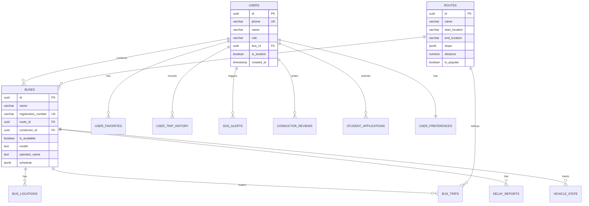

# Database Schema

The application uses **Supabase** (PostgreSQL) with **PostGIS** extension for geographical queries.

> [!NOTE]
> Sensitive information (password hashes, API keys) has been censored from this documentation.

## Entity Relationship Diagram



## Tables Overview

### Core Tables

| Table | Description | Row Count Expectation |
|-------|-------------|----------------------|
| `users` | All registered users (passengers + conductors) | High |
| `buses` | Fleet of registered buses | Medium |
| `routes` | Bus routes with stops (JSONB) | Low-Medium |
| `admins` | Administrator accounts | Very Low |

### Tracking Tables

| Table | Description | Row Count Expectation |
|-------|-------------|----------------------|
| `vehicle_state` | Current bus location (1 per bus) | Low |
| `vehicle_observations` | GPS history for analysis | Very High |
| `bus_locations` | Legacy location data | Deprecated |

### Feature Tables

| Table | Description |
|-------|-------------|
| `bus_trips` | Trip records with status |
| `user_favorites` | User's favorite buses |
| `user_trip_history` | Historical trips |
| `user_preferences` | User profile settings |
| `conductor_shifts` | Shift assignments |
| `conductor_reviews` | Conductor ratings (1-5) |
| `conductor_reports` | Repair/fuel reports |

### Safety & Communication

| Table | Description |
|-------|-------------|
| `sos_alerts` | Emergency alerts with types |
| `bus_messages` | In-app chat messages |
| `delay_reports` | Delay notifications |
| `moderation_filters` | Banned phrases |
| `student_applications` | Student pass requests |

---

## Table Schemas

### users
Primary table for all registered users.

| Column | Type | Constraints | Description |
|--------|------|-------------|-------------|
| `id` | uuid | PK, auto-gen | Unique identifier |
| `phone` | varchar | NOT NULL, UNIQUE | Phone number for auth |
| `name` | varchar | NOT NULL | Display name |
| `role` | varchar | CHECK (user/conductor) | User role |
| `bus_id` | uuid | FK → buses | Assigned bus (conductors) |
| `is_student` | boolean | DEFAULT false | Student status |
| `created_at` | timestamptz | DEFAULT now() | Registration time |

---

### admins
Administrator accounts for web panel access.

| Column | Type | Constraints | Description |
|--------|------|-------------|-------------|
| `id` | uuid | PK, auto-gen | Unique identifier |
| `username` | text | NOT NULL, UNIQUE | Login username |
| `password_hash` | text | [CENSORED] | Hashed password |
| `name` | text | - | Display name |
| `is_active` | boolean | DEFAULT true | Account status |
| `created_at` | timestamptz | DEFAULT now() | Creation time |

> [!CAUTION]
> Password hashes are stored using secure hashing. Never store plain text passwords.

---

### buses
Fleet registry with scheduling information.

| Column | Type | Constraints | Description |
|--------|------|-------------|-------------|
| `id` | uuid | PK, auto-gen | Unique identifier |
| `name` | varchar | NOT NULL | Bus name/number |
| `registration_number` | varchar | NOT NULL, UNIQUE | Vehicle registration |
| `route_id` | uuid | FK → routes | Assigned route |
| `conductor_id` | uuid | FK → users | Assigned conductor |
| `is_available` | boolean | DEFAULT false | Availability status |
| `model` | text | - | Vehicle model |
| `operator_name` | text | - | Operating company |
| `departure_time` | text | - | Scheduled departure |
| `schedule` | jsonb | DEFAULT [] | Weekly schedule |
| `unavailability_reason` | text | - | Reason if unavailable |

---

### routes
Route definitions with embedded stops.

| Column | Type | Constraints | Description |
|--------|------|-------------|-------------|
| `id` | uuid | PK, auto-gen | Unique identifier |
| `name` | varchar | NOT NULL | Route name |
| `start_location` | varchar | NOT NULL | Starting point |
| `end_location` | varchar | NOT NULL | Destination |
| `stops` | jsonb | DEFAULT [] | Array of stop objects |
| `distance` | numeric | - | Total distance (km) |
| `is_popular` | boolean | DEFAULT false | Featured route |

**Stops JSONB Structure:**
```json
[
  {
    "id": "stop Id",
    "name": "Stop Name",
    "lat": 10.1234,
    "lng": 76.5678,
    "order": 1
  }
]
```

---

### vehicle_state
Real-time bus location (one record per bus).

| Column | Type | Constraints | Description |
|--------|------|-------------|-------------|
| `bus_id` | uuid | PK, FK → buses | Bus reference |
| `lat` | double | NOT NULL | Latitude |
| `lng` | double | NOT NULL | Longitude |
| `speed_mps` | double | DEFAULT 0 | Speed (m/s) |
| `heading_deg` | double | DEFAULT 0 | Direction (degrees) |
| `updated_at` | timestamptz | DEFAULT now() | Last update |
| `observation_id` | bigint | FK → vehicle_observations | Source observation |

---

### sos_alerts
Emergency alert system.

| Column | Type | Constraints | Description |
|--------|------|-------------|-------------|
| `id` | uuid | PK, auto-gen | Unique identifier |
| `user_id` | uuid | FK → users, NOT NULL | Alert sender |
| `user_role` | text | CHECK (user/conductor) | Sender role |
| `bus_id` | uuid | FK → buses | Related bus |
| `route_id` | uuid | FK → routes | Related route |
| `lat` | double | NOT NULL | Alert location |
| `lng` | double | NOT NULL | Alert location |
| `alert_type` | text | CHECK | Type of emergency |
| `description` | text | - | Details |
| `status` | text | CHECK | Alert status |
| `acknowledged_by` | uuid | FK → users | Responder |

**Alert Types:** emergency, harassment, accident, medical, other

**Status Values:** active, acknowledged, responding, resolved, false_alarm

---

### conductor_reviews
Passenger ratings for conductors.

| Column | Type | Constraints | Description |
|--------|------|-------------|-------------|
| `id` | uuid | PK, auto-gen | Unique identifier |
| `conductor_id` | uuid | FK → users, NOT NULL | Rated conductor |
| `user_id` | uuid | FK → users, NOT NULL | Rating author |
| `rating` | integer | CHECK (1-5) | Star rating |
| `review_text` | text | - | Optional comment |
| `created_at` | timestamptz | DEFAULT now() | Review time |

---

## Row Level Security (RLS)

All tables have RLS policies enforcing role-based access:

| Role | Read | Write | Delete |
|------|------|-------|--------|
| **Anonymous** | Limited (public routes/buses) | ❌ | ❌ |
| **User** | Own data + public | Own data | Own data |
| **Conductor** | Assigned bus + route | Location updates | ❌ |
| **Admin** | All data | All data | All data |

> [!IMPORTANT]
> RLS policies are enforced at the database level. See Supabase dashboard for exact policy definitions.

---

## Indexes

Key indexes for query performance:

```sql
-- Location queries
CREATE INDEX idx_vehicle_state_updated ON vehicle_state(updated_at);
CREATE INDEX idx_observations_bus_time ON vehicle_observations(bus_id, observed_at);

-- User lookups
CREATE INDEX idx_users_phone ON users(phone);
CREATE INDEX idx_users_role ON users(role);

-- Route searches  
CREATE INDEX idx_routes_popular ON routes(is_popular) WHERE is_popular = true;
```

---

*For API usage, see [API Reference](./api.md)*
